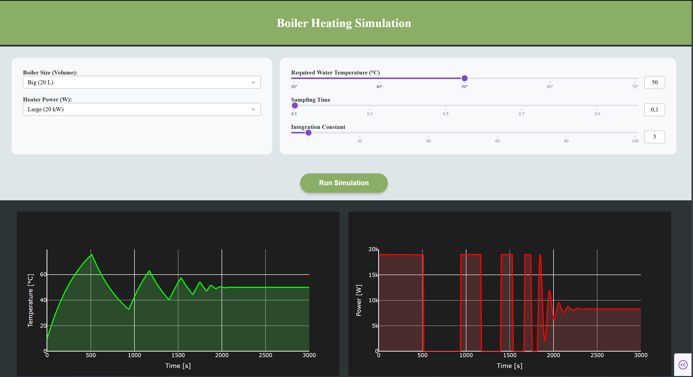

# Automated heater with PI controller simulation

Python-based thermal simulation of a closed boiler system. Features a discrete PI control algorithm and interactive dashboard powered by **Dash** and **Plotly**.

## About

The application allows visualization of the temperature change over time, based on selected parameters of the PI controller and boiler specifications (size and heater). Main purpose of the application is to show how the PI controller automatically regulates heating power, to keep flowing water at desired temperature.



The discrete PI controller is implemented using the following equation:

$$
u(n) = k_p \left[ e(n) + \frac{T_p}{T_i} \sum_{k=0}^{n} e(k) \right]
$$

where:
- **Kp** – proportional gain  
- **Ti** – integral time constant  
- **Tp** – sampling period  
- **u(n)** – control signal   
- **e(n)** – control error

Special thanks to <a href="https://github.com/Majorx500">Majorx500</a> for identifying the physics equations used in this project.

### Main features:
* **Physics Simulation:** Accounts for water heat capacity, heater power, and fluid flow.
* **PI Controller:** Enables testing the impact of proportional gain ($K_p$) and integral time ($T_i$) on system stability.
* **Interactive Dashboard:** Temperature and power consumption charts generated using Plotly.

## Technologies
* **Python 3.14**
* **Dash 4.1.0** 
* **Plotly 6.6.0**

## How to run?
1. **Clone the repository:**
   ```bash
   git clone https://github.com/Nezzusa/boiler-pi-sim.git
   cd boiler-pi-sim
   ```
2. **Install dependencies**
   ```bash
   py -m pip install -r requirements.txt
   ```
3. **Run the script**
   ```bash
   py main.py
   ```

